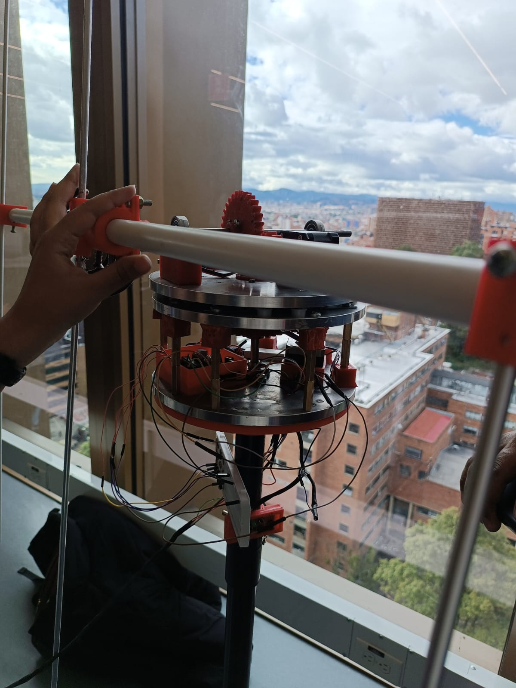

# Satelital-Tracking-System
Mecatronic system focused on the tracking of satelital network NOAA. 

This project presents the design and implementation of a low-cost, portable satellite tracking and signal processing system capable of receiving and generating images from NOAA satellites.

The main objective is to develop a system that improves the quality and frequency of satellite image acquisition by combining real-time tracking with signal conditioning and processing. The proposed solution addresses key limitations of traditional static reception systems, such as low signal quality and inefficiencies in manual tracking.

The system integrates multiple engineering domains, including:

- **Mechanical design**: Development of a portable structure and a tracking mechanism with at least two degrees of freedom (DoF) to orient a directional antenna toward the satellite.

- **Electronic design**: Implementation of signal acquisition using an RTL-SDR device, motor control hardware, and feedback sensors for closed-loop operation.

- **Software development**: Processing of orbital data, coordinate transformations, real-time control algorithms, and signal demodulation to generate satellite images.

The solution is specifically designed to operate within the NOAA satellite frequency range (137–138 MHz) and to function under real environmental conditions, ensuring robustness and portability.

This system has potential applications in environmental monitoring, disaster management, agriculture, telecommunications, and scientific research, providing accessible satellite data for governments, companies, and researchers.

